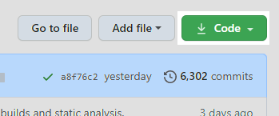
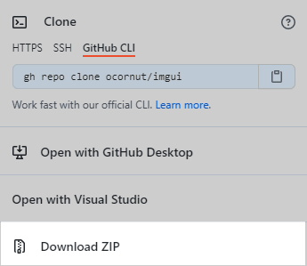

# Obtaining and Building the Dear ImGui Source

**The core of Dear ImGui is self-contained within a few platform-agnostic files** which you can easily compile in your
application/engine. They are all the files in the root folder of the repository
 - imgui.h
 - imgui_internal.h
 - imgui.cpp
 - imgui_demo.cpp
 - imgui_draw.cpp
 - imgui_tables.cpp
 - imgui_widgets.cpp

And, you will need to compile the applicable backend files.
(Located in [backends/imgui_impl_XXX.cpp](https://github.com/ocornut/imgui/tree/master/backends))
**You can read all about [backends here](../reference/backends.md)**.

A few other files included in the repository are:
 - examples/ -- Complete example projects for various platforms
 - docs/ -- Dear ImGui documentation in the form of markdown files for offline documentation viewing
 - misc -- Misc. Dear ImGui tools
   - cpp/ -- C++ STL type support (std::string) for InputText()
   - fonts/ -- Several font files that work well with Dear ImGui, as well as tools to embed fonts in your app/game
   - freetype/ -- FreeType font rasterization support for Dear ImGui
   - natvis/ -- Natvis debugging files which help the Visual Studio (MSVC) debugger understand Dear ImGui types (Like ImVector<>)
   - single_file/ -- Used for single file/unity build users, not recommended

## Obtaining the Source Code

The first part of building Dear ImGui is actually getting the source code. There are a plethora of ways to manage dependencies.
If you're brand new to managing C++ dependencies, using git submodules or vcpkg is highly recommended. However, Dear ImGui is
independent of build systems and package managers; if you already have your preferred dependency manager, feel free to use that
tool instead.

<!-- tabs:start -->

### **Git Submodules**

```bash
 $ git submodule add https://github.com/ocornut/imgui
```

### **Vcpkg**

```batch
 > .\vcpkg\vcpkg install imgui
 > .\vcpkg\vcpkg integrate install
```

### **CMake**

 * CMake version \>3.3

```cmake
find_package(imgui REQUIRED)
...
target_link_libraries(<my-target> ... imgui ...)
```

 * CMake version 2.8.12 - 3.2

```cmake
find_package(imgui REQUIRED)
...
add_exutable(<my-target> ... ${IMGUI_SOURCES})
target_link_libraries(<my-target> ... imgui ...)
```

### **Conan**

See https://github.com/bincrafters/conan-imgui and https://bintray.com/bincrafters/public-conan/imgui%3Abincrafters.

### **Github Web Download**

Github allows users to *Download as Zip*. While it is generally recommended that you use a package management solution, this is a
viable way of obtaining Dear ImGui Source.

First, click the green `Download Code` button.



Then, click the `Download ZIP` button.



The download will now begin in your browser. As it is a ZIP file you will have to extract it's contents and move them into your
project.

<!-- tabs:end -->

## Try the Examples

Before adding Dear ImGui to an existing project, it is recommended that users try to fist build the examples. In fact, if you don't have an
existing app that you wish to integrate Dear ImGui into, the examples may be used as a starting template.

First, choose an example with you given pair of backends. (These are all located in the [examples/](https://github.com/ocornut/imgui/tree/master/examples) folder)
And then each example has a README file with config & build instructions. Please follow those exactly.

?> If you want to use a build tool such as premake, cmake, or GN etc. Please see the [list of third party build tools support](https://github.com/ocornut/imgui/wiki/Home2#building).

Once you have an example project running:
 - [I want to learn how to embed Dear ImGui in my existing application](#a-note-about-backends), or
 - [The example is enough, I want to learn how to use Dear ImGui](./usage.md)

From here on, until [usage](./usage.md), this guide will assume you want to embed Dear ImGui in your existing project.

## A Note about Backends

Dear ImGui is platform independent. However, in order to provide Dear ImGui with the necessary inputs/outputs, you will have to
provide platform dependant functions. These are called backends, which are required to integrate Dear ImGui in your app. The
backend passes mouse/keyboard/gamepad inputs and variety of settings to Dear ImGui, and is in charge of rendering the
resulting vertices.

**Backends for a variety of graphics api and rendering platforms** are provided in the
[backends/](https://github.com/ocornut/imgui/tree/master/backends) folder, along with example applications displaying their usage in the
[examples/](https://github.com/ocornut/imgui/tree/master/examples) folder. See the section on
[Integration](./getting-started/integrating) for details. You may also create your own backend, if necessary. However, this is
only recommended for advanced users.

?> This is a very high level overview of backends. For the curious, see the
   [backend reference](../reference/backends.md) - which is much more in depth.

**Each backend contains a `.cpp` file that will need to be built alongside Dear ImGui.**

## Building the Source

**No specific build process is required**. You can add the .cpp files to your existing project. Or you can build your project
based off of the numerous prebuilt [example/starter projects](https://github.com/ocornut/imgui/tree/master/examples).
Remember, that must include **all** of the `*cpp` files listed at the [beginning](./building.md) of this guide. **And** it must include
your backend's `*.cpp` files.

*If you are already comfortable compiling 3rd party libraries feel free to skip to the [next section](./integrating.md)*

However, to accommodate everyone, we've included step-by-step instructions for several common build systems.

<!-- tabs:start -->

### ** Visual Studio **

TODO

### ** CMake **

TODO

### ** Premake **

TODO

### ** Make **

TODO

<!-- tabs:end -->

Congratulations! You should now be able to successfully build Dear ImGui alongside your project. However, this should have no
effect on your project (other than slightly longer compile time.) This is because we haven't called any Dear ImGui functions
yet.

If you encounter any errors throughout this process, please make sure you've followed every step exactly as described.
And if you still encounter errors, please ask a [thorough question](https://bit.ly/3nwRnx1) in the
[issue tracker](https://github.com/ocornut/imgui/issues).
